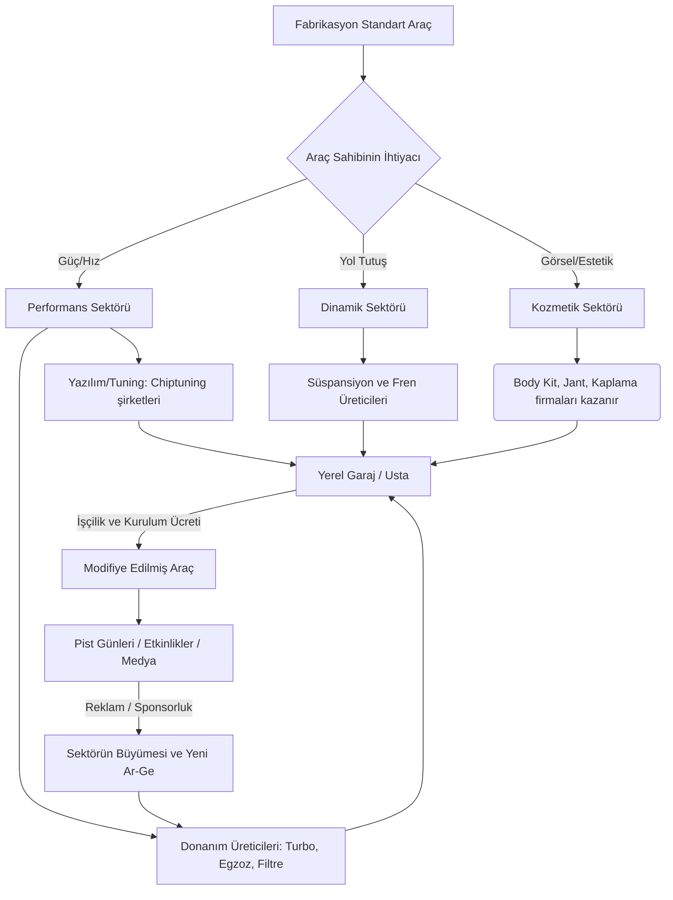

# 🌐 Otomobil Modifikasyon Sektörü: Kökenler ve Ekonomi

Herhangi bir teknik projeye (donanım takma, yazılım atma) başlamadan önce, milyarlarca dolarlık bu endüstrinin (Aftermarket / Tuning Sektörü) **neden var olduğunu** ve **nasıl işlediğini** anlamak, olaylara sadece bir tamirci gibi değil, bir girişimci ve mühendis gibi bakmamızı sağlar.

---

## 1. Bu Sektör Nasıl Ortaya Çıktı?

Otomobil modifikasyon kültürünün kökenleri aslında çok organik bir şekilde, insanların "standart" olanla yetinmemesinden doğmuştur:

*   **Motor Sporları ve Homologasyon:** 1960'lar ve 70'lerde ralliler ve pist yarışları popülerleştikçe, markalar yarış arabalarındaki teknolojileri (daha iyi frenler, çift boğazlı karbüratörler, aerodinamik eklemeler) sivil araçlara entegre etmeye başladı.
*   **Sokak Kültürü ve Japonya (JDM):** 1980'ler ve 90'larda özellikle Japonya'da katı fabrika hız limitleri (Gentlemen's Agreement) vardı. Ancak araçların motorları (örn. Supra'nın 2JZ'si, Skyline'ın RB26'sı) inanılmaz dayanıklıydı. İnsanlar bu limitleri kırmak için kendi garajlarında araçları kurcalamaya başladılar. "Tuning" kültürü bir alt kültür olarak sokaklardan fırladı.
*   **Kişiselleştirme Tutkusu:** Otomobiller fabrikadan "herkese uysun, az yaksın, sessiz olsun ve uzun ömürlü olsun" diye kompromis (ödün) verilerek çıkar. Modifikasyon kültürü ise *"Benim aracım herkesinki gibi olmasın, karakteri olsun"* diyenlerin başlattığı bir akımdır.

## 2. İnsanlar Neden Binlerce Dolar Harcıyor?

Başkaları için bir demir yığını olan şeye, otomobil tutkunlarının servet harcamasının arkasında temelde şu motivasyonlar yatar:

*   **Performans ve Adrenalin:** Arabanın hızlanma süresini yarım saniye kısaltmak veya bir virajı daha stabil dönmek, sürücüye mekanik bir tatmin ve adrenalin sağlar.
*   **Psikolojik Sahiplik ve Aidiyet:** Bir araca kendi emeğinle veya bütçenle bir parça eklediğinde, o araç senin "özel" tasarımın olur. Ayrıca bu kültür, kendi içinde devasa bir sosyalleşme (araba buluşmaları, forumlar, kulüpler) ağı yaratır.
*   **Mühendislik Tatmini:** Bir makinenin sınırlarını zorlamak ve fabrikasyon kısıtlamaları alt etmenin verdiği başarma hissi.

## 3. Sektör Nasıl Para Kazanıyor? (İş Modeli)

Aftermarket (Satış Sonrası) sektörü sadece sanayideki ustadan ibaret değildir; devasa bir endüstridir. Temel gelir kalemleri şunlardır:

1.  **Ar-Ge ve Mühendislik (Markalar):** HKS, K&N, Brembo, Garrett gibi dev firmalar. Milyonlarca dolar Ar-Ge yapıp, fabrikasyon parçadan daha verimli/dayanıklı parçayı üretip tüm dünyaya pazarlarlar (Donanım Satışı).
2.  **Yazılım ve Kalibrasyon (Tuning Firmaları):** Arabanın beynine (ECU) atılan yazılımlar. Markalar (örn: APR, Revo, Cobb) devasa bir Ar-Ge ile yazılım geliştirir. Bu yazılımın lisansını veya kendi ürettikleri donanım aletleriyle (Accessport gibi) satışını yaparlar. Satılan şey aslında "veri ve koddur", kar marjı çok yüksektir.
3.  **Uygulama ve İşçilik (Garajlar):** Parçaları veya yazılımı araca düzgün bir şekilde entegre eden, arıza tespiti yapan ve testleri yürüten birimlerdir.
4.  **Medya ve Etkinlikler:** YouTube kanalları, dergiler, pist günleri (Track days), otomobil fuarları (SEMA Show gibi) bu kültürün pazarlama ve reklam bütçelerinin döndüğü devasa alanlardır.

---

## 🔄 Modifikasyon Ekosistemi Akış Şeması

Aşağıdaki şema, sıradan bir fabrikasyon aracın, modifikasyon sektörünün çarklarına girip nasıl değer (ve para) döngüsü yarattığını gösteriyor:

Bu şemaya bakarak, gelecekte kendimizi bu pastanın neresinde konumlandırabileceğimizi (Parça mı üreteceğiz? Yazılım mı atacağız? Yoksa sadece hobi olarak tüketici mi olacağız?) daha net stratejilendirebiliriz.
